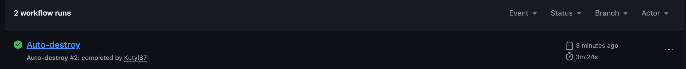

IMPORTANT ❗ ❗ ❗ Please remember to destroy all the resources after each work session. You can recreate infrastructure by creating new PR and merging it to master.
  


1. Authors:

   ***18***

   ***https://github.com/Kutyl87/tbd-workshop-1***
   
2. Follow all steps in README.md.

3. From avaialble Github Actions select and run destroy on main branch.
   
4. Create new git branch and:
    1. Modify tasks-phase1.md file.
    
    2. Create PR from this branch to **YOUR** master and merge it to make new release. 
    
    
    ***place the screenshot from GA after succesfull application of release***


5. Analyze terraform code. Play with terraform plan, terraform graph to investigate different modules.
    
    Ten moduł Terraform tworzy w projekcie Google Cloud repozytorium Dockerowe w Artifact Registry. Najpierw włącza potrzebną usługę Artifact Registry, żeby można było tworzyć repozytoria. Potem tworzy właściwe repozytorium w regionie europe i pozwala na nadpisywanie tagów obrazów. Moduł generuje też nazwę hosta rejestru na podstawie podanej lokalizacji. Na końcu udostępnia tę nazwę jako output, żeby można było używać jej w innych częściach infrastruktury.

    ***describe one selected module and put the output of terraform graph for this module here***
   
6. Reach YARN UI

   
   ```gcloud compute ssh tbd-cluster-m \
      --project=tbd-2025z-318384 \
      -- -L 8088:localhost:8088
    ```
   ***place the command you used for setting up the tunnel, the port and the screenshot of YARN UI here***
   
7. Draw an architecture diagram (e.g. in draw.io) that includes:
    1. Description of the components of service accounts
    2. List of buckets for disposal
    
    ***place your diagram here***

8. Create a new PR and add costs by entering the expected consumption into Infracost
For all the resources of type: `google_artifact_registry`, `google_storage_bucket`, `google_service_networking_connection`
create a sample usage profiles and add it to the Infracost task in CI/CD pipeline. Usage file [example](https://github.com/infracost/infracost/blob/master/infracost-usage-example.yml) 

   `
  google_artifact_registry_repository.registry:
    storage_gb: 150
    monthly_egress_data_transfer_gb: 50
  google_storage_bucket.dataproc_staging:
    storage_gb: 150
  google_storage_bucket.dataproc_temp:
    storage_gb: 150
    monthly_egress_data_transfer_gb: 150
  google_service_networking_connection.private_vpc_connection:
    monthly_egress_data_transfer_gb: 150
    `

   ***place the expected consumption you entered here***
   
   ***place the screenshot from infracost output here***

9. Create a BigQuery dataset and an external table using SQL
    
    ***place the code and output here***
    ```
    CREATE OR REPLACE EXTERNAL TABLE
  `tbd-2025z-318384`.tbddataset.external_orc_table( column_a STRING,
    column_b INT64,
    column_c TIMESTAMP) OPTIONS ( format = 'ORC',
    uris = ['gs://tbd-318384z-data/*.orc']);
    ```
   
    ***why does ORC not require a table schema?***
    Schema is automatically retrieved from the self-describing source data.
10. Find and correct the error in spark-job.py
    ***describe the cause and how to find the error***
    The cause of the error:
    ```
    ERROR: (gcloud.dataproc.jobs.submit.pyspark) Job [d193bf60d00541e18364bb1686934c78] failed with error:
    Google Cloud Dataproc Agent reports job failure. If logs are available, they can be found at:
    https://console.cloud.google.com/dataproc/jobs/d193bf60d00541e18364bb1686934c78?project=tbd-2025z-318384&region=europe-west1
    gcloud dataproc jobs wait 'd193bf60d00541e18364bb1686934c78' --region 'europe-west1' --project 'tbd-2025z-318384'
    https://console.cloud.google.com/storage/browser/tbd-2025z-318384-dataproc-staging/google-cloud-dataproc-metainfo/fc41f046-7fa6-49f5-aa9d-abe950c45c22/jobs/d193bf60d00541e18364bb1686934c78/
    gs://tbd-2025z-318384-dataproc-staging/google-cloud-dataproc-metainfo/fc41f046-7fa6-49f5-aa9d-abe950c45c22/jobs/d193bf60d00541e18364bb1686934c78/driveroutput.*
    ```
    The issue is because of the bucket name. After changing it to my own bucket it worked.
    
11. Add support for preemptible/spot instances in a Dataproc cluster
    path: ```modules/dataproc/main.tf```
    ```
    preemptible_worker_config {
      num_instances  = 2
    }
    ```
    ***place the link to the modified file and inserted terraform code***
    
12. Triggered Terraform Destroy on Schedule or After PR Merge. Goal: make sure we never forget to clean up resources and burn money.

Add a new GitHub Actions workflow that:
  1. runs terraform destroy -auto-approve
  2. triggers automatically:
   
   a) on a fixed schedule (e.g. every day at 20:00 UTC)
   
   b) when a PR is merged to main containing [CLEANUP] tag in title

Steps:
  1. Create file .github/workflows/auto-destroy.yml
  2. Configure it to authenticate and destroy Terraform resources
  3. Test the trigger (schedule or cleanup-tagged PR)
     
***paste workflow YAML here***
```
name: Destroy
on:
  schedule:
    - cron: "0 20 * * *"
  push:
    branches:
      - main

permissions: read-all
jobs:
  destroy-release:
    runs-on: ubuntu-latest
  # Add "id-token" with the intended permissions.
    permissions:
      contents: write
      id-token: write
      pull-requests: write
      issues: write

    steps:
    - uses: 'actions/checkout@v3'
    - uses: hashicorp/setup-terraform@v2
      with:
        terraform_version: 1.11.0
    - id: 'auth'
      name: 'Authenticate to Google Cloud'
      uses: 'google-github-actions/auth@v1'
      with:
        token_format: 'access_token'
        workload_identity_provider: ${{ secrets.GCP_WORKLOAD_IDENTITY_PROVIDER_NAME }}
        service_account: ${{ secrets.GCP_WORKLOAD_IDENTITY_SA_EMAIL }}
    - name: Terraform Init
      id: init
      run: terraform init -backend-config=env/backend.tfvars
    - name: Terraform Destroy
      id: destroy
      run: terraform destroy -no-color -var-file env/project.tfvars -auto-approve
      continue-on-error: false
```
***paste screenshot/log snippet confirming the auto-destroy ran***

***write one sentence why scheduling cleanup helps in this workshop***
Scheduling automatic cleanup ensures that all temporary workshop resources are regularly destroyed, preventing leftover infrastructure from generating unexpected costs.